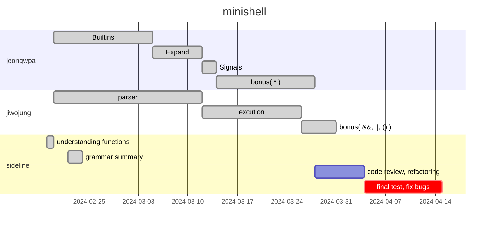
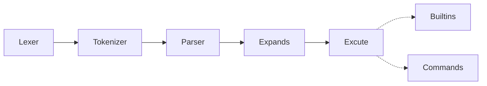

## [Introdution](#creating-a-simple-shell-shell)
## [Work Flow](#work-flow-1)
## [Architecture](#architecture-1)
## [Works](#works-1)
[Builtins](#builtins-1)   
[Expands](#expands-1)   
[Signals](#signals-1)   
[Parser](#parser-1)   
[Excution](#excution-1)   
[Bonus](#bonus-1)   

## [Warning!](#warning-1)

# [creating a simple shell] :shell:

This project is about creating a simple shell by simple [rules](minishell.pdf)   

Minishell is a project to creating a lightweight shell capable of parsing and executing **simple commands**, **pipe line**, **redirections** from a single line input.   

It features custom-built built-in commands(`cd`, `echo` ...), handles environment variables, maintains command history, and effectively manages signals and errors.   

This minishell is based on [bash](https://opensource.apple.com/source/bash/bash-106/doc/bashref.html)   

Yeah, we make own little bash :trollface:
---

## WORK FLOW

## Architecture

---

# WORKS

## Builtins

**`echo`** with option -n   

**`cd`** with only a relative or absolute path

**`pwd`** with no options

**`export`** with no options

**`unset`** with no options

**`env`** with no options or arguments

**`exit`** with no options

## Expands

**Handle environment variables ($ followed by a sequence of characters) which should expand to their values**   

## Signals

**ctrl-C displays a new prompt on a new line**   
**ctrl-D exits the shell**   
**ctrl-\ does nothing**   

**also it works differently with **`cat`****

## Parser

**Lexer & Tokenizer includes**

**Create own `AST`**

**Create it with reference to [grammar](#grammar)**   

## Excution

**Implement **redirections** ( <, >, <<, >> )**

**Implement **pipes** ( | character )**

## Bonus

**Implement `&&`, `||`, `parenthesis for priorities`**   
[example](https://github.com/orgs/shelldivers/discussions/13)

**Implement wildcards `*`**    

---

### Error

**Handling exit status, error messages**   

## [GRAMMAR](grammar.md)

## Warning!

### usage

We do not handle unclosed quotes!   

If a quote remains unclosed and leaves an odd number of quotes, the remaining quote is interpreted as a single character!   

Please be mindful of this when using   

### compatibility

The program is compiled by `clang 12` with `Mac OS`   
You can use our makefile for compile, but it requires GNU's readline library!

***enjoy our shell***:trollface:

