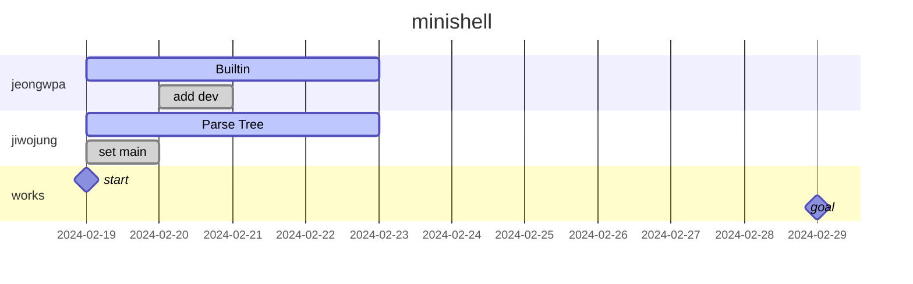

# creating a simple shell :shell:

This project is about creating a simple shell by simple [rules](SUBJECT.md)   

Minishell is a project to creating a lightweight shell capable of parsing and executing **simple commands**, **pipe line**, **redirections** from a single line input.   

It features custom-built built-in commands(`cd`, `echo` ...), handles environment variables, maintains command history, and effectively manages signals and errors.   

This minishell is based on [bash](https://opensource.apple.com/source/bash/bash-106/doc/bashref.html)   

Yeah, we make own little bash :trollface:


## [Work Flow](#work-flow)
## [Architecture](#design)

## [Works](#todo-1)

### [**jeongwpa**](#jeongwpa)
#### [Builtins](#Builtins)

### [**jiwojung**](#jiwojung)
#### [Parse Tree](#parse-tree)

## [Rules](#rules)
---

## [WORK FLOW]



## [Design]


---

# [WORKS]

## [jeongwpa]

### [Builtins 구현]

#### **`echo`** with option -n   

#### **`cd`** with only a relative or absolute path

#### **`pwd`** with no options

#### **`export`** with no options

#### **`unset`** with no options

#### **`env`** with no options or arguments

#### **`exit`** with no options

### [Expand]
### [Signal]

## [jiwojung]

### [Parse Tree]
### [Excute]

---

### [Error]

# [GRAMMAR]

```bison
/* -------------------------------------------------------
   The grammar symbols
   ------------------------------------------------------- */
%token  WORD			// 명령어 집합
%token	IO_NUMBER

/* The following are the operators (see XBD Operator)
   containing more than one character. */

%token  AND_IF    OR_IF    PIPE    LBRACE    RBRACE
/*      '&&'      '||'     '|'       '('       ')'    */


%token  DLESS  DGREAT   DREAD  DWRITE   
/*      '<<'   '>>'     '<'     '>'    */


/* -------------------------------------------------------
   The Grammar
   ------------------------------------------------------- */
%start and_or
%%
and_or :               		     pipeline
                 | and_or AND_IF pipeline
                 | and_or OR_IF  pipeline
                 ;
pipeline         :               command
                 | pipeline PIPE command
				     ;
command          : simple_command
                 | subshell
				     | subshell redirect_list
                 ;
subshell         : LBRACE and_or RBRACE
                 ;
simple_command   : redirect_list cmd_word cmd_suffix
                 | redirect_list cmd_word
                 | redirect_list
                 | cmd_word cmd_suffix
                 | cmd_word
                 ;
cmd_word         : WORD
                 ;
redirect_list    :               io_redirect
                 | redirect_list io_redirect
                 ;
cmd_suffix       :            io_redirect
                 | cmd_suffix io_redirect
                 |            WORD
                 | cmd_suffix WORD
                 ;
io_redirect      :           io_file
                 |           io_here
                 ;
io_file          : DREAD     filename
                 | DWRITE    filename
                 | DGREAT    filename
                 ;
filename         : WORD
                 ;
io_here          : DLESS     here_end
                 ;
here_end         : WORD
                 ;
```


# [Rules]

1. 이식성이 높고 자주 사용하기 용이한 함수의 경우 ft_ 를 prefix 에 붙여서 `libft` 에 추가   
ex) ft_strcmp   


