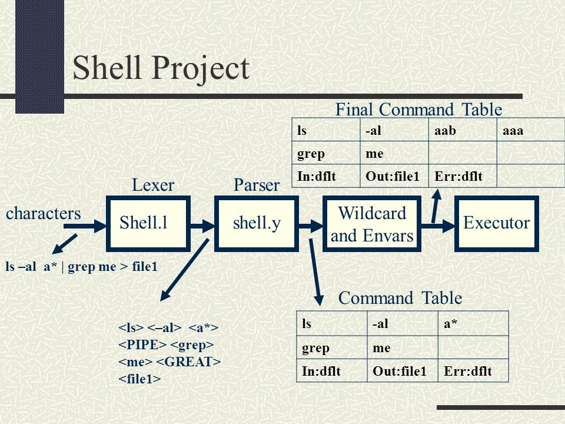

## [쉘의 구성요소](#parts-of-a-shell-program)
- [구문 분석](#the-parser)
- [실행자](#the-Executor)
- [하위 시스템](#shell-subsystems)

# [Parts of a Shell Program]

## [The Parser]   

"ls -al" 과 같은 명령줄을 읽고 실행할 명령줄을 `Command Table` 이라는 자료구조에 담는 것   



## [The Executor]   

실행자는 구문 분석으로 생성한 `Command Table` 을 가져와 해당 배열의 모든 `Simple Command` 에 대한 새로운 프로세스를 생성한다   
필요한 경우 파이프를 생성하여 한 프로세스의 출력을 다음 프로세스의 입력으로 전달한다   
또한, 리디렉션이 있는 경우 STD I/O/E 를 리디렉트 한다   

## [Shell Subsystems]   

하위 시스템에는 다음과 같은 종류가 있다   

- 환경변수(Environment Variables)
	${VAR} 과 같은 형식의 표현식이 해당 환경변수의 변수로 확장 되어야 한다   
	또한 쉘은 환경변수에 대해 `설정`, `확장`, `출력` 을 할 수 있어야 한다   

- 와일드카드(Wild Cards)
	a*a 의 형식을 받은 인수는 로컬 디렉터리 및 여러 디렉터리에서 일치하는 모든 파일로 확장 되어야 한다   

- 서브 쉘(Sub Shells)
	`` 사이의 인수는 실행되고 출력은 쉘로 전송된다   

```bash
result=`ls -l`

echo "now directory is : `pwd`"
```


